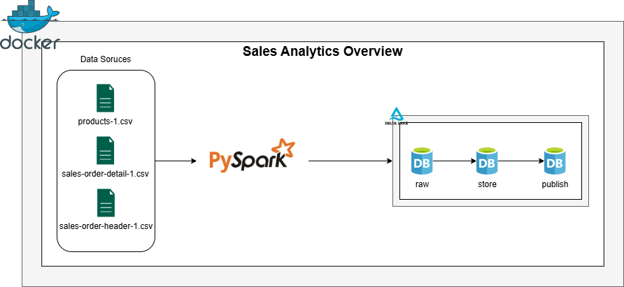

# Sales Analytics Pipeline (PySpark + Delta Lake)

## Overview

This project implements a **data lakehouse pipeline** using **PySpark and Delta Lake** to process sales data.

The pipeline follows a **Medallion Architecture**, separating the data processing into three layers:

- **Raw** → Ingestion of source CSV files
- **Store** → Data cleaning and standardization
- **Publish** → Business-ready datasets for analytics

The final datasets are used to answer analytical questions through notebooks and visualizations.

---

## Architecture



Data is stored using **Delta Lake tables**, enabling reliable storage and scalable transformations.

---

## Technologies Used

- **Python**
- **PySpark**
- **Delta Lake**
- **Docker**
- **Docker Compose**
- **Matplotlib / Pandas** (for analytics notebooks)

---

## Project Structure
.
├── docker-compose.yml
├── Dockerfile
├── README.md
│
├── data
│ ├── input
│ └── lake
│
├── notebooks
│ └── analytical_questions.ipynb
│
└── src
├── main.py
├── ingestion.py
├── spark_session.py
│
├── transformations
│ ├── store_products_transformation.py
│ ├── store_sales_order_header.py
│ ├── store_sales_order_detail.py
│ ├── publish_products.py
│ └── publish_orders.py
│
└── utils
├── logger.py
├── schema_manager.py
└── table_writer.py


---

## Running the Project

### 1️⃣ Start the environment

Build and start the containers:

```bash
docker compose up --build
```

2️⃣ Run the pipeline

After the environment is running, execute the pipeline:

```bash
python main.py
```

if you're using linux:

```bash
python3 main.py
```
---
### Analytical Questions

The project answers the following business questions:

1️⃣ Which color generated the highest revenue each year?

This analysis identifies the top-performing product color by revenue per year.

2️⃣ What is the average LeadTimeInBusinessDays by ProductCategoryName?

This analysis evaluates order fulfillment performance across product categories.

Both analyses and visualizations are available in the notebooks/ directory.

--- 
### Logging

The pipeline includes structured logging for:

Ingestion processes

Data transformations

Table writes

This helps track execution steps and debug potential issues.